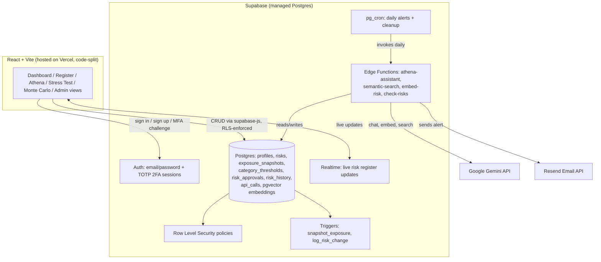

# Enterprise Risk Management Platform

[](https://github.com/Kunal-svg-cyber/erm-dashboard/actions/workflows/ci.yml)
[](https://erm-dashboard-six.vercel.app)
[](./LICENSE)

A production-grade Enterprise Risk Management system for tracking, scoring, and reporting organizational risk — built with database-enforced access control, two-factor authentication, inherent/residual risk modeling, AI-assisted analysis, and automated governance workflows.

**Live app:** erm-dashboard-six.vercel.app

## Features

### Security & access control
- **Row-Level Security (RLS)** — every read/write to the risk register is authorized at the PostgreSQL layer, not the frontend. A three-tier role model (`admin` / `owner` / `viewer`) is enforced via database policies, so even a compromised frontend cannot bypass permissions.
- **Two-factor authentication (TOTP)** — users enroll via QR code; login is gated on session assurance level (AAL1 → AAL2), not just session presence, via a dedicated MFA challenge screen.
- **Approval workflow** — an owner cannot unilaterally close or downgrade a Critical risk. The change queues in an approvals table; an admin reviews and approves or rejects it before it's applied.
- **Client-side login rate limiting** — progressive lockout after repeated failed sign-in attempts, layered on Supabase's own server-side limits.
- **Password strength enforcement** on signup (8+ characters, mixed case, numbers, symbols).
- **Rate-limited AI endpoints** — Athena, semantic search, and auto-embedding are capped per user per hour to protect free-tier API quota from abuse; admins are exempt.
- **Hardened database functions** — `SECURITY DEFINER` execute scope, mutable `search_path`, and public extension placement issues (flagged by Supabase's security linter) are explicitly locked down.

### Risk management & analytics
- **Inherent vs. residual risk tracking** — every risk carries a before-mitigation and after-mitigation score; a dashboard-wide toggle switches the heatmap, stats, and register between the two views.
- **Per-category risk appetite thresholds** — tolerance is configurable per category rather than one global cutoff, with automatic breach flagging.
- **5x5 likelihood x impact heatmap** with a visual risk-appetite frontier line; clickable cells filter the register.
- **Monte Carlo simulation** — models portfolio exposure as a probability distribution (P50/P90/P95/P99) instead of a single fixed number, using a triangular distribution around each risk's current score.
- **Stress testing** — five preset macro scenarios (market volatility, liquidity crunch, cyber surge, regulatory crackdown, counterparty default) plus a custom per-category shock builder, with AI-generated executive narratives.
- **Concentration analysis** — flags when too much aggregate exposure sits with a single owner or category, mirroring institutional investor/counterparty concentration monitoring.
- **Automatic exposure trend tracking** — a database trigger snapshots aggregate risk exposure on every mutation, building a real historical time series with zero manual logging.
- **Lightweight risk history** — a timeline of status and score changes per risk, populated automatically by a database trigger.

### AI & search
- **Athena** — an AI risk assistant (Google Gemini) that answers natural-language questions strictly from the live risk register, with multi-turn conversation memory. Never invents data not actually in the database.
- **Semantic search** — finds risks by meaning rather than keyword match, using pgvector embeddings generated automatically whenever a risk is saved.

### Data ingestion & reporting
- **Bulk import from CSV or PDF**, sharing one validation engine with fuzzy column-name matching and forgiving date parsing. PDF import reconstructs tables directly from raw text positions (no OCR) and auto-merges wrapped multi-line cells.
- **Executive PDF reports** with live-captured chart images (heatmap + trend), not static templates.
- **Real-time collaboration** — risk register updates propagate to every connected user instantly via Supabase Realtime.

### Administration
- **In-app admin panel** — manage user roles, category risk-appetite thresholds, and pending approval requests without touching SQL.
- **Automated email alerts** — a scheduled serverless function checks daily for critical or overdue risks and emails a summary via Resend.
- **Error monitoring** — Sentry captures and reports frontend crashes automatically.

### UX & accessibility
- **Dark mode** with a full theme toggle via CSS custom properties.
- **Responsive layout** — sidebar, stat grid, heatmap, and filters all reflow for mobile screens.
- **Accessibility** — keyboard-operable data tables, visible focus indicators, screen-reader labels on icon-only controls, `aria-live` status announcements, and a skip-to-content link. Enforced automatically via Lighthouse CI.
- **Hover tooltips** on every sidebar icon; sidebar icons carry full accessible names for screen readers too.

### Engineering practices
- **Full CI/CD pipeline (GitHub Actions)**: unit tests → live RLS integration tests (signs into the real database as three different roles and proves permissions actually hold) → production build → Playwright end-to-end tests against the deployed site → Lighthouse accessibility/performance audit. All on every commit.
- **Code-split architecture** — non-default views load as separate chunks, fetched only when visited; measured a 42% reduction in initial bundle size (414 KB → 238 KB gzipped).
- **Architecture Decision Records** (`docs/adr/`) documenting the reasoning and tradeoffs behind every major technical decision, including real bugs found and fixed along the way.
- **Unit-tested core logic** — risk scoring, banding, and appetite-threshold logic is extracted into a pure, independently tested module.

## Architecture



## Tech stack

| Layer | Technology |
|---|---|
| Frontend | React 18, Vite (code-split), `lucide-react`, `recharts` |
| Backend | Supabase (PostgreSQL, Auth, Row-Level Security, Realtime, Edge Functions, pgvector) |
| AI | Google Gemini API (chat + embeddings), rate-limited per user |
| Reporting | `jspdf`, `html2canvas`, `papaparse`, `pdfjs-dist` |
| Hosting | Vercel (auto-deploy from GitHub) |
| Email | Resend, triggered via `pg_cron` |
| Error monitoring | Sentry |
| CI/CD | GitHub Actions — Vitest (unit + live integration), Playwright (E2E), Lighthouse CI |

## Data model

| Table | Purpose |
|---|---|
| `profiles` | One row per user; `role` is `admin` / `owner` / `viewer` |
| `risks` | The register: title, category, inherent + residual likelihood/impact, owner, status, mitigation plan, dates, pgvector embedding |
| `exposure_snapshots` | Append-only aggregate history, written automatically on every risk change |
| `category_thresholds` | Per-category risk appetite score, editable by admins |
| `risk_approvals` | Queued changes to Critical risks awaiting admin sign-off |
| `risk_history` | Lightweight timeline of status/score changes per risk |
| `api_calls` | Rate-limit tracking for AI-powered endpoints |

## Project structure

```
erm-dashboard/
├── .github/workflows/ci.yml         # Unit + integration + E2E + Lighthouse, every push
├── .lighthouserc.json               # Accessibility/performance audit config
├── docs/adr/                        # Architecture Decision Records
├── supabase-schema.sql              # Core schema: profiles, risks, RLS policies
├── elite-upgrade-schema.sql         # Admin permissions, exposure_snapshots, trigger
├── residual-risk-schema.sql         # Residual risk fields + category_thresholds
├── approval-and-history-schema.sql  # risk_approvals + risk_history + trigger
├── semantic-search-schema.sql       # pgvector + match_risks RPC
├── rate-limiting-schema.sql         # api_calls table + cleanup job
├── security-advisor-fixes.sql       # Linter-flagged hardening fixes
├── supabase-function/
│   ├── check-risks.ts               # Daily critical/overdue risk alerts
│   ├── athena-assistant.ts          # AI risk chat (rate-limited)
│   ├── semantic-search.ts           # pgvector-powered search (rate-limited)
│   └── embed-risk.ts                # Auto-embeds risks on save (rate-limited)
├── e2e/critical-flows.spec.js       # Playwright tests against the live site
├── src/
│   ├── App.jsx                      # Root: theme, auth gate, dashboard shell, routing
│   ├── Auth.jsx / MFAChallenge.jsx / MFAEnroll.jsx
│   ├── AdminPanel.jsx               # Roles, thresholds, approval queue
│   ├── Athena.jsx                   # AI assistant chat UI
│   ├── StressTest.jsx / MonteCarlo.jsx / ConcentrationAnalysis.jsx
│   ├── SemanticSearch.jsx / TrendChart.jsx
│   ├── riskLogic.js                 # Pure scoring/banding/appetite logic (unit tested)
│   ├── importShared.js / importUtils.js / pdfImportUtils.js
│   ├── exportUtils.js / executiveReport.js
│   └── __tests__/                   # Unit tests + live RLS integration tests
└── package.json
```

## Setup

No local build step required — designed to be edited via the GitHub web UI and deployed automatically by Vercel.

1. Run the SQL files in Supabase's SQL Editor, in order: `supabase-schema.sql` → `elite-upgrade-schema.sql` → `residual-risk-schema.sql` → `approval-and-history-schema.sql` → `semantic-search-schema.sql` → `rate-limiting-schema.sql` → `security-advisor-fixes.sql`
2. Deploy the four Edge Functions via the Supabase dashboard's function editor
3. Enable Realtime on the `risks` table (Database → Replication)
4. Set environment variables in Vercel: `VITE_SUPABASE_URL`, `VITE_SUPABASE_ANON_KEY`, `VITE_SENTRY_DSN`
5. Set the same as GitHub Actions secrets, plus `TEST_ADMIN_EMAIL/PASSWORD`, `TEST_OWNER_EMAIL/PASSWORD`, `TEST_VIEWER_EMAIL/PASSWORD` for CI
6. Enable TOTP under Supabase Authentication → Multi-Factor

## Security notes

- All access control is enforced by Postgres RLS policies, not hidden UI buttons — a `viewer` role cannot write to the `risks` table even via a direct API call, and cannot bypass 2FA even if client-side session state resolves before verification (a real race condition found and fixed during development — see `docs/adr/002`).
- CI proves this isn't just a claim: every commit signs into the live database as three real accounts (admin/owner/viewer) and asserts what each can and cannot do.
- The Supabase `service_role` key is only ever used inside Edge Functions (server-side); the frontend uses only the public `anon`/publishable key.
- AI endpoints are rate-limited per user to prevent free-tier quota exhaustion, with admins exempt.

## License

All Rights Reserved — see [`LICENSE`](./LICENSE). This is proprietary software; no part of it may be copied, modified, or redistributed without the copyright holder's express written permission.
