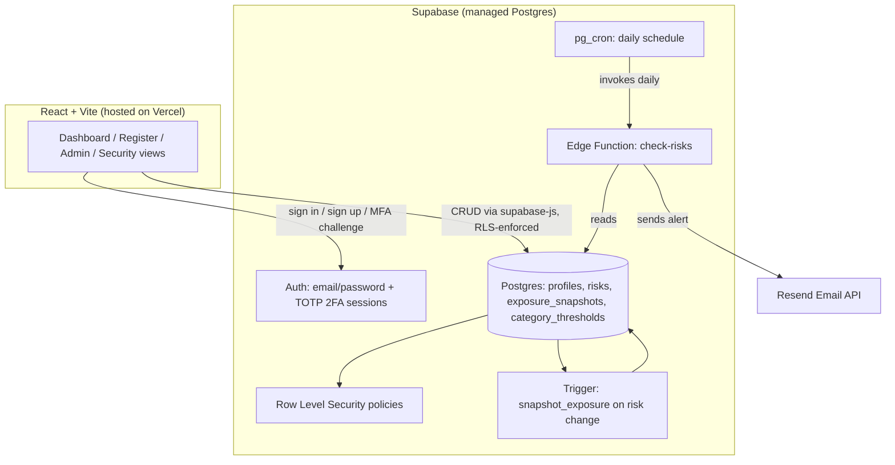

# Enterprise Risk Management Platform

[](https://github.com/Kunal-svg-cyber/erm-dashboard/actions/workflows/ci.yml)
[](https://erm-dashboard-six.vercel.app)
[](./LICENSE)

A production-grade Enterprise Risk Management system for tracking, scoring, and reporting organizational risk — built with database-enforced access control, two-factor authentication, inherent/residual risk modeling, and automated risk telemetry.

**Live app:** erm-dashboard-six.vercel.app

## Features

### Security & access control
- **Row-Level Security (RLS)** — every read/write to the risk register is authorized at the PostgreSQL layer, not the frontend. A three-tier role model (`admin` / `owner` / `viewer`) is enforced via database policies, so even a compromised frontend cannot bypass permissions.
- **Two-factor authentication (TOTP)** — users enroll via QR code from an authenticator app. Login is gated on session assurance level (AAL1 → AAL2), not just session presence, via a dedicated MFA challenge screen that sits between authentication and dashboard access.
- **Client-side login rate limiting** — progressive lockout (exponential backoff) after repeated failed sign-in attempts, layered on top of Supabase's own server-side rate limits.
- **Password strength enforcement** — signup requires 8+ characters with mixed case, numbers, and symbols.
- **Hardened database functions** — `SECURITY DEFINER` execute scope and `search_path` mutability issues (flagged by Supabase's security linter) are explicitly locked down.

### Risk management
- **Inherent vs. residual risk tracking** — every risk carries two scores: inherent (before mitigation) and residual (after). A dashboard-wide toggle switches the heatmap, stats, and register between the two views, so mitigation's actual effect on exposure is visible, not just the starting severity.
- **Per-category risk appetite thresholds** — each risk category has its own configurable tolerance (not one global cutoff). Risks that meet or exceed their category's threshold are flagged with a ⚠ indicator wherever they appear. Admins manage thresholds in-app, no SQL required.
- **5x5 likelihood x impact heatmap** with a visual risk-appetite frontier line; clickable cells filter the register.
- **Automatic exposure trend tracking** — a database trigger snapshots aggregate risk exposure on every risk mutation, building a real historical time series with zero manual logging.
- **Full risk register** — create, edit, and track risks with category, likelihood/impact scoring, owner, status, and mitigation plans.
- **Bulk import from CSV or PDF** — CSV and PDF table imports share the same validation engine, with flexible/fuzzy column-name matching, forgiving date parsing, and clear per-row error messages. PDF import reconstructs tables directly from text positions (no OCR needed) and automatically merges wrapped multi-line cells back into single rows.
- **Executive PDF reports** — generates board-ready PDFs with live-captured chart images (heatmap + trend), not static templates.

### Administration
- **In-app admin panel** — promote/demote user roles and edit category risk-appetite thresholds without touching SQL.
- **Automated email alerts** — a scheduled serverless function checks daily for critical or overdue risks and emails a summary via Resend.

### UX
- **Dark mode** — full theme toggle via CSS custom properties.
- **Responsive layout** — sidebar, stat grid, heatmap, and filters all reflow for mobile screens.
- **Accessibility** — keyboard-operable data tables, visible focus indicators, screen-reader labels on icon-only controls, `aria-live` status announcements, and a skip-to-content link. Enforced automatically via Lighthouse CI (accessibility score gates the build below 90).

### Engineering practices
- **CI pipeline (GitHub Actions)** — every commit runs automated unit tests and a full production build check before merge.
- **Unit-tested core logic** — risk scoring, banding, and appetite-threshold logic is extracted into a pure, independently tested module (13 tests, covering inherent/residual scoring and threshold edge cases).

## Architecture



## Tech stack

| Layer | Technology |
|---|---|
| Frontend | React 18, Vite, `lucide-react`, `recharts` |
| Backend | Supabase (PostgreSQL, Auth, Row-Level Security, Edge Functions) |
| Reporting | `jspdf`, `html2canvas` (executive PDF with live chart capture) |
| Data import | `papaparse` (CSV), `pdfjs-dist` (PDF table extraction) |
| Hosting | Vercel (auto-deploy from GitHub on push to `main`) |
| Email | Resend, triggered via Supabase `pg_cron` |
| CI | GitHub Actions (test + build verification on every commit) |
| Testing | Vitest |

## Data model

| Table | Purpose |
|---|---|
| `profiles` | One row per user; `role` is `admin` / `owner` / `viewer` |
| `risks` | The register: title, category, inherent + residual likelihood/impact, owner, status, mitigation plan, dates |
| `exposure_snapshots` | Append-only aggregate history, written automatically by a trigger on every risk change |
| `category_thresholds` | Per-category risk appetite score, editable by admins |

## Project structure

```
erm-dashboard/
├── .github/workflows/ci.yml         # CI: tests + build check on every push
├── supabase-schema.sql              # Core schema: profiles, risks, RLS policies
├── elite-upgrade-schema.sql         # Admin permissions + exposure_snapshots + trigger
├── residual-risk-schema.sql         # Residual risk fields + category_thresholds table
├── supabase-function/
│   └── check-risks.ts               # Edge Function: daily critical/overdue risk alerts
├── src/
│   ├── App.jsx                      # Root: theme provider, auth gate, dashboard shell
│   ├── Auth.jsx                     # Sign in / sign up, password strength, rate limiting
│   ├── MFAChallenge.jsx             # 2FA code verification screen (post-login gate)
│   ├── MFAEnroll.jsx                # 2FA enrollment (QR code + confirm)
│   ├── AdminPanel.jsx               # User role management + risk appetite thresholds
│   ├── TrendChart.jsx               # Exposure history chart
│   ├── riskLogic.js                 # Pure scoring/banding/appetite logic (unit tested)
│   ├── importShared.js              # Shared header-mapping + row validation (CSV + PDF)
│   ├── importUtils.js               # CSV import + template download
│   ├── pdfImportUtils.js            # PDF table extraction + import
│   ├── exportUtils.js               # CSV/PDF export
│   ├── executiveReport.js           # Executive PDF generation (chart capture)
│   └── __tests__/
│       └── riskLogic.test.js        # Unit tests for scoring/banding/appetite logic
└── package.json
```

## Architecture decisions

Key design tradeoffs are documented as Architecture Decision Records in [`docs/adr/`](./docs/adr) — why RLS instead of app-layer permissions, why a queued approval table instead of a database constraint, why client-side simulation for stress testing, and more.

## Setup

This project has no local build requirement — it's designed to be edited via the GitHub web UI and deployed automatically by Vercel.

1. Run `supabase-schema.sql`, then `elite-upgrade-schema.sql`, then `residual-risk-schema.sql` in the Supabase SQL Editor (in that order)
2. Deploy `supabase-function/check-risks.ts` via the Supabase dashboard's Edge Function editor
3. Set environment variables in Vercel: `VITE_SUPABASE_URL`, `VITE_SUPABASE_ANON_KEY`
4. Set repository secrets in GitHub Actions (same two values) so CI builds succeed
5. Enable TOTP under Supabase Authentication → Multi-Factor

## Security notes

- All access control is enforced by Postgres RLS policies, not hidden UI buttons — a `viewer` role cannot write to the `risks` table even via a direct API call, and cannot bypass 2FA even if the client-side session state resolves before verification (a real race condition found and fixed during development).
- The Supabase `service_role` key is only ever used inside the Edge Function (server-side); the frontend uses only the public `anon`/publishable key.
- `SECURITY DEFINER` functions have explicit `search_path` pinning and restricted execute grants, per Supabase's security linter recommendations.
