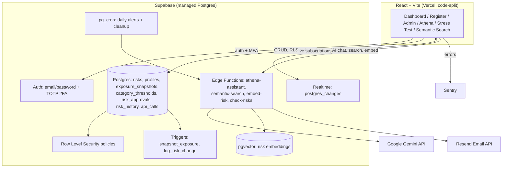

# Enterprise Risk Management Platform

[](https://github.com/Kunal-svg-cyber/erm-dashboard/actions/workflows/ci.yml)
[](https://erm-dashboard-six.vercel.app)
[](./LICENSE)

A production-grade Enterprise Risk Management system modeling the core workflow of an institutional risk function — risk identification, inherent/residual scoring, mitigation tracking, governance, quantitative simulation, and executive reporting — built with database-enforced access control and automated risk telemetry.

**Live app:** erm-dashboard-six.vercel.app

## Features

### Security & access control
- **Row-Level Security (RLS)** — every read/write to the risk register is authorized at the PostgreSQL layer, not the frontend. A three-tier role model (`admin` / `owner` / `viewer`) is enforced via database policies.
- **Two-factor authentication (TOTP)** — login is gated on session assurance level (AAL1 → AAL2) via a dedicated MFA challenge screen, not just session presence.
- **Rate-limited AI endpoints** — Athena, semantic search, and auto-embedding are capped per-user, per-hour to protect free-tier API quota. Admins are exempt; enforced server-side before any external API call is made, so a blocked request costs zero quota.
- **Client-side login rate limiting** — progressive lockout after repeated failed sign-in attempts, layered on Supabase's own server-side limits.
- **Hardened database functions** — `SECURITY DEFINER` execute scope and `search_path` mutability, flagged by Supabase's security linter, are explicitly locked down.

### Governance
- **Approval workflow** — an owner cannot unilaterally close or downgrade a Critical risk; the change queues for admin sign-off instead of applying directly.
- **Immutable risk history** — a database trigger logs every status/score change automatically, with zero manual audit logging.
- **Per-category risk appetite thresholds** — tolerance is configurable per category rather than one global cutoff, with automatic breach flagging.

### Risk methodology
- **Inherent vs. residual risk modeling** — every risk carries a before- and after-mitigation score, with a dashboard-wide toggle to compare both.
- **5x5 likelihood x impact heatmap** with a visual risk-appetite frontier line.
- **Automatic exposure trend tracking** via database triggers — zero manual logging.

### Quantitative & AI capabilities
- **Monte Carlo simulation** — models portfolio exposure as a probability distribution (P50/P90/P95/P99), not a single point score, using triangular-distribution sampling per risk.
- **Scenario-based stress testing** — preset macro scenarios (market volatility, liquidity crunch, cyber surge, regulatory crackdown, counterparty default) plus custom shocks, with AI-generated executive narratives.
- **Athena** — a natural-language risk assistant grounded strictly in live database state (never invents data), with multi-turn conversation memory.
- **Semantic search** — vector-embedding search (pgvector + Gemini embeddings) over risk descriptions and mitigation plans, matching by meaning rather than keyword.
- **Portfolio concentration analysis** — flags when too much aggregate exposure sits with a single owner or category.
- **Bulk import from CSV or PDF** — shared validation engine with fuzzy column matching; PDF import reconstructs tables from raw text positions (no OCR) and auto-merges wrapped multi-line cells.
- **Executive PDF reports** — board-ready output with live-captured chart images, not static templates.

### Real-time & collaboration
- **Live updates** via Supabase Realtime — risk changes propagate to every open session instantly, no manual refresh.

### Engineering practices
- **CI pipeline (GitHub Actions)** — on every commit: unit tests, RLS permission tests executed against the live database (signs in as three real roles and proves what each can/can't do), a production build check, Playwright E2E tests driving the actual deployed site, and Lighthouse accessibility auditing.
- **Performance** — code-split via `React.lazy`; reduced initial bundle 42% (414KB → 238KB gzipped) by deferring non-default views and PDF libraries until actually needed.
- **Accessibility** — keyboard-operable data tables, visible focus indicators, screen-reader labels, `aria-live` status announcements, skip-to-content link.
- **Error monitoring** — Sentry integration in production.
- **Architecture Decision Records** — key tradeoffs documented in [`docs/adr/`](./docs/adr), including real bugs found and fixed during development.

## Architecture



## Tech stack

| Layer | Technology |
|---|---|
| Frontend | React 18, Vite, `lucide-react`, `recharts` |
| Backend | Supabase (PostgreSQL, pgvector, Auth, Row-Level Security, Edge Functions, Realtime) |
| AI | Google Gemini (chat + embeddings), rate-limited per-user server-side |
| Reporting | `jspdf`, `html2canvas`, `papaparse`, `pdfjs-dist` |
| Hosting | Vercel (auto-deploy from GitHub) |
| Email | Resend, triggered via `pg_cron` |
| CI/Testing | GitHub Actions, Vitest, Playwright, Lighthouse CI |
| Monitoring | Sentry |

## Data model

| Table | Purpose |
|---|---|
| `profiles` | One row per user; `role` is `admin` / `owner` / `viewer` |
| `risks` | The register: inherent + residual likelihood/impact, category, status, mitigation, vector embedding |
| `exposure_snapshots` | Append-only aggregate history, written by trigger |
| `category_thresholds` | Per-category risk appetite score |
| `risk_approvals` | Queued approval requests for Critical risk changes |
| `risk_history` | Immutable log of status/score changes, written by trigger |
| `api_calls` | Rate-limit tracking for AI-backed Edge Functions |

## Project structure

```
erm-dashboard/
├── .github/workflows/ci.yml         # Unit + RLS integration + E2E + Lighthouse
├── .lighthouserc.json
├── playwright.config.js
├── docs/adr/                        # Architecture Decision Records
├── supabase-schema.sql              # Core schema: profiles, risks, RLS
├── elite-upgrade-schema.sql         # Admin permissions, exposure_snapshots
├── residual-risk-schema.sql         # Residual fields, category_thresholds
├── approval-and-history-schema.sql  # risk_approvals, risk_history, triggers
├── semantic-search-schema.sql       # pgvector, embedding column, match_risks
├── rate-limiting-schema.sql         # api_calls table, cleanup cron
├── security-advisor-fixes.sql
├── supabase-function/
│   ├── athena-assistant.ts          # AI risk assistant (rate-limited)
│   ├── semantic-search.ts           # Vector search (rate-limited)
│   ├── embed-risk.ts                # Auto-embed on save (rate-limited)
│   └── check-risks.ts               # Daily critical/overdue alert email
├── src/
│   ├── App.jsx                      # Root: theme, auth gate, dashboard shell
│   ├── Auth.jsx / MFAChallenge.jsx / MFAEnroll.jsx
│   ├── AdminPanel.jsx               # Roles, thresholds, pending approvals
│   ├── Athena.jsx / StressTest.jsx / MonteCarlo.jsx
│   ├── ConcentrationAnalysis.jsx / SemanticSearch.jsx / TrendChart.jsx
│   ├── riskLogic.js                 # Pure scoring/banding logic (unit tested)
│   ├── importShared.js / importUtils.js / pdfImportUtils.js
│   ├── exportUtils.js / executiveReport.js
│   └── __tests__/
│       ├── riskLogic.test.js
│       └── integration/rls.integration.test.js
├── e2e/critical-flows.spec.js
└── package.json
```

## Setup

No local build required — designed to be edited via the GitHub web UI and deployed automatically by Vercel.

1. Run the SQL files in Supabase's SQL Editor, in the order listed under **Project structure** above
2. Deploy each file in `supabase-function/` via the Supabase Dashboard's Edge Function editor
3. Enable `pgvector`, `pg_cron`, and Realtime (on the `risks` table) in Supabase
4. Set environment variables in Vercel: `VITE_SUPABASE_URL`, `VITE_SUPABASE_ANON_KEY`, `VITE_SENTRY_DSN`
5. Set the same as GitHub Actions secrets, plus `TEST_ADMIN_EMAIL/PASSWORD`, `TEST_OWNER_EMAIL/PASSWORD`, `TEST_VIEWER_EMAIL/PASSWORD` for CI
6. Add `GEMINI_API_KEY` and `RESEND_API_KEY` as Edge Function secrets

## Architecture decisions

Key tradeoffs — why RLS over app-layer auth, the 2FA race condition found and fixed, why stress testing runs client-side, the free-tier serverless architecture, and more — are documented in [`docs/adr/`](./docs/adr).

## Security notes

- All access control is enforced by Postgres RLS policies, not hidden UI buttons.
- The Supabase `service_role` key is only ever used inside Edge Functions; the frontend uses only the public `anon` key.
- `SECURITY DEFINER` functions have explicit `search_path` pinning and restricted execute grants.
- AI-backed endpoints are rate-limited server-side, before any external API call, to prevent quota exhaustion.
