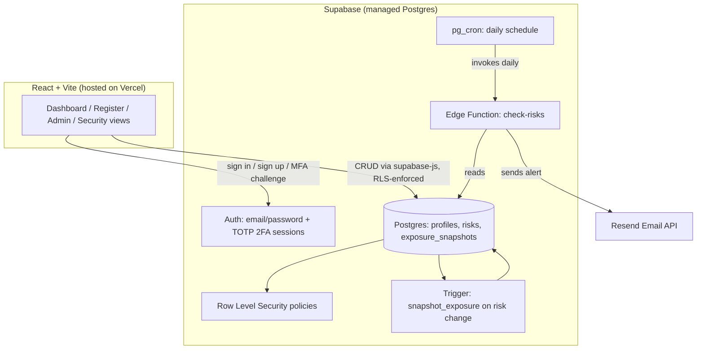

# Enterprise Risk Management Platform

A production-grade Enterprise Risk Management system for tracking, scoring, and reporting organizational risk — built with database-enforced access control, two-factor authentication, automated risk telemetry, and executive reporting.

**Live app:** erm-dashboard-six.vercel.app

## Features

### Security & access control
- **Row-Level Security (RLS)** — every read/write to the risk register is authorized at the PostgreSQL layer, not the frontend. A three-tier role model (`admin` / `owner` / `viewer`) is enforced via database policies, so even a compromised frontend cannot bypass permissions.
- **Two-factor authentication (TOTP)** — users enroll via QR code from an authenticator app; login requires a verified 6-digit code before a session is granted, gated through a dedicated assurance-level check.
- **Client-side login rate limiting** — progressive lockout (exponential backoff) after repeated failed sign-in attempts, layered on top of Supabase's own server-side rate limits.
- **Password strength enforcement** — signup requires 8+ characters with mixed case, numbers, and symbols (client-side substitute for Supabase's paid-tier leaked-password check).
- **Hardened database functions** — `SECURITY DEFINER` execute scope and `search_path` mutability issues (flagged by Supabase's security linter) have been explicitly locked down.

### Risk management
- **5x5 likelihood x impact heatmap** with a visual risk-appetite frontier line; clickable cells filter the register
- **Automatic exposure trend tracking** — a database trigger snapshots aggregate risk exposure (avg. score, critical count, open count) on every risk mutation, building a real historical time series with zero manual logging
- **Full risk register** — create, edit, and track risks with category, likelihood/impact scoring, owner, status, and mitigation plans
- **Bulk CSV import/export** — import a batch of risks with row-level validation, or export the current filtered view
- **Executive PDF reports** — generates board-ready PDFs with live-captured chart images (heatmap + trend), not static templates

### Administration
- **In-app admin panel** — promote/demote user roles without touching SQL
- **Automated email alerts** — a scheduled serverless function checks daily for critical or overdue risks and emails a summary via Resend

### UX
- **Dark mode** — full theme toggle via CSS custom properties
- **Responsive layout** — sidebar, stat grid, heatmap, and filters all reflow for mobile screens

### Engineering practices
- **CI pipeline (GitHub Actions)** — every commit runs automated unit tests and a full production build check before merge
- **Unit-tested core logic** — risk scoring and banding logic is extracted into a pure, independently tested module

## Architecture



## Tech stack

| Layer | Technology |
|---|---|
| Frontend | React 18, Vite, `lucide-react`, `recharts` |
| Backend | Supabase (PostgreSQL, Auth, Row-Level Security, Edge Functions) |
| Reporting | `jspdf`, `html2canvas` (executive PDF with live chart capture), `papaparse` (CSV import) |
| Hosting | Vercel (auto-deploy from GitHub on push to `main`) |
| Email | Resend, triggered via Supabase `pg_cron` |
| CI | GitHub Actions (test + build verification on every commit) |
| Testing | Vitest |

## Data model

| Table | Purpose |
|---|---|
| `profiles` | One row per user; `role` is `admin` / `owner` / `viewer` |
| `risks` | The register: title, category, likelihood/impact (1-5), owner, status, mitigation plan, dates |
| `exposure_snapshots` | Append-only aggregate history, written automatically by a trigger on every risk change |

## Project structure

```
erm-dashboard/
├── .github/workflows/ci.yml      # CI: tests + build check on every push
├── supabase-schema.sql           # Core schema: profiles, risks, RLS policies
├── elite-upgrade-schema.sql      # Admin permissions + exposure_snapshots + trigger
├── supabase-function/
│   └── check-risks.ts            # Edge Function: daily critical/overdue risk alerts
├── src/
│   ├── App.jsx                   # Root: theme provider, auth gate, dashboard shell
│   ├── Auth.jsx                  # Sign in / sign up, password strength, rate limiting
│   ├── MFAChallenge.jsx          # 2FA code verification screen
│   ├── MFAEnroll.jsx             # 2FA enrollment (QR code + confirm)
│   ├── AdminPanel.jsx            # User role management
│   ├── TrendChart.jsx            # Exposure history chart
│   ├── riskLogic.js              # Pure scoring/banding logic (unit tested)
│   ├── exportUtils.js            # CSV/PDF export
│   ├── importUtils.js            # CSV import + validation
│   ├── executiveReport.js        # Executive PDF generation (chart capture)
│   └── __tests__/
│       └── riskLogic.test.js     # Unit tests for scoring logic
└── package.json
```

## Setup

This project has no local build requirement — it's designed to be edited via the GitHub web UI and deployed automatically by Vercel.

1. Run `supabase-schema.sql`, then `elite-upgrade-schema.sql` in the Supabase SQL Editor
2. Deploy `supabase-function/check-risks.ts` via the Supabase dashboard's Edge Function editor
3. Set environment variables in Vercel: `VITE_SUPABASE_URL`, `VITE_SUPABASE_ANON_KEY`
4. Set repository secrets in GitHub Actions (same two values) so CI builds succeed
5. Enable TOTP under Supabase Authentication → Multi-Factor

## Security notes

- All access control is enforced by Postgres RLS policies, not hidden UI buttons — a `viewer` role cannot write to the `risks` table even via a direct API call
- The Supabase `service_role` key is only ever used inside the Edge Function (server-side); the frontend uses only the public `anon`/publishable key
- `SECURITY DEFINER` functions have explicit `search_path` pinning and restricted execute grants, per Supabase's security linter recommendations
