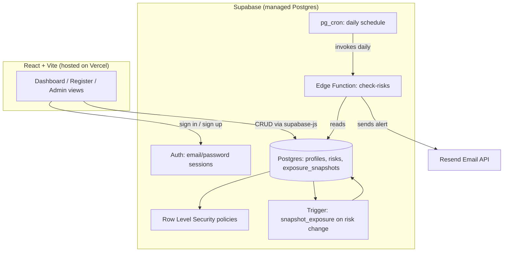

# Enterprise Risk Management Dashboard

A role-based, real-time enterprise risk register with a likelihood x impact heatmap, exposure trend tracking, CSV/PDF reporting, and automated critical-risk email alerts.

## Features

- **5x5 risk heatmap** with a risk-appetite frontier line, clickable cells filter the register
- **Role-based access control** enforced at the database level (Postgres Row Level Security), not just the UI:
  - `admin` — full edit/delete access to every risk, manages user roles
  - `owner` — can create risks and edit/delete only the ones they created
  - `viewer` — read-only
- **In-app admin panel** for promoting/demoting users without touching SQL
- **Exposure trend chart** — average risk score and critical-risk count over time, built from an automatic snapshot trigger
- **CSV and PDF export** of the risk register for board reporting
- **Automated daily email alerts** for critical or overdue risks via a scheduled Supabase Edge Function

## Architecture

## Stack

- **Frontend**: React 18 + Vite, `lucide-react` icons, `recharts` for the trend chart
- **Backend**: Supabase (Postgres + Auth + Row Level Security + Edge Functions)
- **Hosting**: Vercel (auto-deploys from GitHub on every push to `main`)
- **Email**: Resend, triggered by a Supabase `pg_cron` schedule

## Data model

- `profiles` — one row per user; `role` is `admin` / `owner` / `viewer`
- `risks` — the register itself: title, category, likelihood/impact (1-5), owner, status, mitigation plan, dates
- `exposure_snapshots` — append-only aggregate history, written by a database trigger every time a risk is created, edited, or deleted

## Local setup

There is no local build step required — this project is designed to be edited via the GitHub web UI and deployed automatically by Vercel. See `elite-upgrade-schema.sql` and `supabase-schema.sql` for the full database setup, and `supabase-function/check-risks.ts` for the alerting function (deployed via the Supabase Dashboard's built-in function editor, no CLI needed).

## Security notes

- All access control is enforced by Postgres RLS policies, not just hidden UI buttons — a `viewer` account cannot write to the `risks` table even via direct API calls
- The Supabase `service_role` key is only ever used inside the Edge Function (server-side); the frontend only ever uses the public `anon`/publishable key
